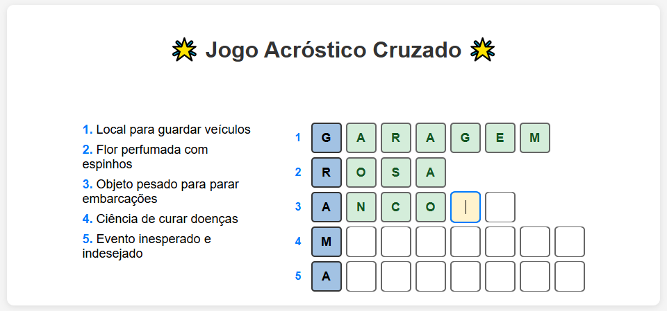
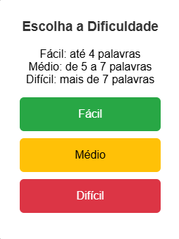
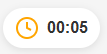
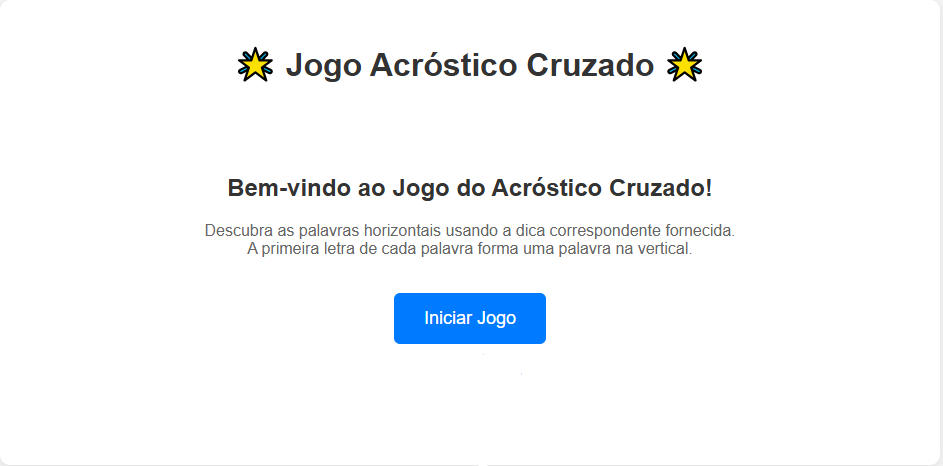
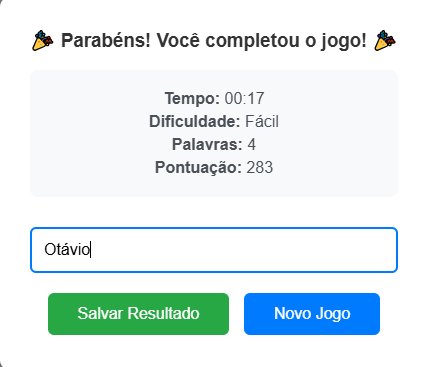
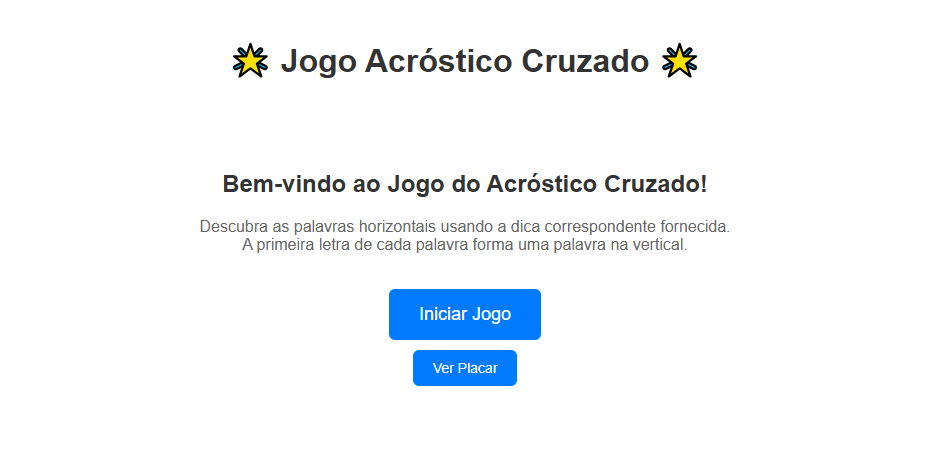
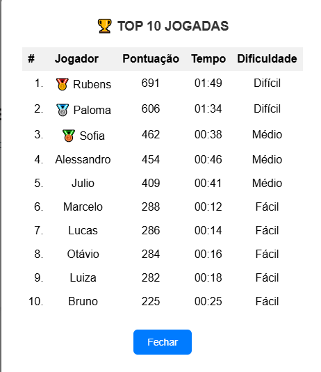

# Ideia
Inicialmente, fiquei em dúvida do que fazer. Depois de muito pensar, de repente visualizo minha mãe jogando um joguinho em seu celular. Então tive uma ideia: lembrei que ela gostava muito de jogar um jogo de celular chamado "Cody Cross". Com isso, decidi implementar um jogo de Acróstico Cruzado. É um jogo divertido, o qual eu gosto de jogar e que pode ser jogado por mais pessoas aqui de minha casa. A lógica do jogo é a seguinte: há algumas palavras na horizontal para serem respondidas com base em dicas, e em cada palavra horizontal a primeira letra já está inicialmente preenchida. Essas letras formam uma palavra na vertical.

# Processo de criação do jogo
A seguir, descrevo como foi o processo de criação do jogo, as dificuldades encontradas pelo caminho e algumas outras informações.

## 1.
Para uma primeira versão, decidi criar a estrutura que armazena a palavra vertical e as palavras horizontais. Do seguinte modo:

<pre>
data Acrostic = Acrostic
  { vertical    :: Entry
  , horizontals :: [Entry]
  } deriving (Show, Generic)
</pre>

Nesta versão, para ir testando, as palavras eram fixas e ainda estavam "inteiras", sem considerar cada letra individualmente. Tive que converter para o formato de JSON, para se adequar e fazer as requisições. Testei por meio de GET, para ver se o servidor Scooty conseguia pegar as palavras e entregá-las formatadas. Funcionou, sem maiores dificuldades.

## 2.
Tendo feito o passo inicial, estava pronto para ir à próxima fase: decompor cada palavra letra a letra, para que pudessem ser identificadas cada uma das letras presentes na palavra individualmente. Para isso, precisei criar mais uma estrutura. Essa estrutura guardava também o estado atual do jogo (progress, com uma lista de listas de Char), onde cada uma das letras poderia ser preenchida individualmente. Ela era assim:

<pre>data GameState = GameState
  { verticalWord :: Entry
  , horizontalsW :: [Entry]
  , progress     :: [[Maybe Char]]
  }
</pre>

A palavra vertical já vinha com todas as suas posições preenchidas, e as horizontais apenas com as primeiras. Nessa parte, tive maiores dificuldades na "validação" da letra, na hora que eu fazia um POST como uma tentativa, porque teria que verificar se exatamente naquela posição, a letra correta da palavra era a que eu tinha digitado com o POST. Para essa parte, tive que estudar o melhor jeito de fazer um "loop" verificando letra a letra. Cheguei à conclusão que a melhor maneira de fazer isso no paradigma funcional é por meio de recursão, utilizando pattern matching para testar cada caso (letra certa, letra errada, etc.). Para aplicar uma tentativa por meio de POST, utilizei essa estrutura:

<pre>
data Try = Try
  { index    :: Int    -- índice da palavra horizontal
  , position :: Int    -- posição da letra
  , letter   :: Char   -- letra tentada
  } deriving (Show, Generic)
</pre>

Ela guarda o índice da palavra horizontal, a posição correspondente de cada letra e a letra tentada pelo POST. O maior problema que tive foi conseguir fazer com que a primeira letra de cada horizontal fosse a letra correspondente da vertical. Depois de algumas funções auxiliares criadas e decompondo esse problema em partes menores, consegui concluir.

## 3.
Para a parte 3, decidi aprimorar o sistema de palavras. A partir daí, resolvi fazer com que as palavras selecionadas para o jogo fossem aleatórias. A minha ideia inicial era utilizar uma API que gerasse palavras em português, para que eu pudesse usar essa palavra como argumento para outra API que buscaria o seu significado e usaria isso como a dica para descobrir a palavra. Porém, infelizmente não achei uma API que gerasse palavras em português. Então, tive que criar minha própria API. Criei uma estrutura para isso, com o formato da seguinte maneira:

<pre>
entries :: [Entry]
entries =
  [Entry "PALAVRA" "Dica"]
</pre>

Pesquisando qual IA Generativa consegue escrever longas respostas, encotrei o Claude AI. Registrei uma conta e o solicitei a criação de 500 palavras, seguindo o formato estipulado, gerando as palavras e suas dicas correspondentes, com o seguinte prompt:

<pre>
A seguir, tenho uma pequena lista de palavras com suas respectivas dicas para a sua definição. Aumente essa lista para 500 palavras. Me mande somente a lista, já formatada. Coloque palavras que iniciam com todas as letras do alfabeto utilizado no Brasil, não incluindo apenas "K", "W" e "Y".
Lista:

entries :: [Entry]
entries =
  [ Entry "ABACAXI" "Fruta tropical de casca espinhosa"
  , Entry "BICICLETA" "Meio de transporte com duas rodas"
  , Entry "CASA" "Local onde moramos"
  , Entry "DIA" "Período de 24 horas"
  , Entry "ESCOLA" "Lugar de estudo"
  , Entry "FOLHA" "Parte de uma planta"
  , Entry "GATO" "Animal doméstico felino"
  , Entry "HELICOPTERO" "Aeronave com hélices"
  , Entry "ILHA" "Porção de terra cercada de água"
  , Entry "JARDIM" "Espaço com plantas cultivadas"
  , Entry "LEAO" "Grande felino carnívoro"
  , Entry "MESA" "Móvel para refeições ou trabalho"
  , Entry "NAVIO" "Transporte marítimo"
  , Entry "OLHO" "Órgão da visão"
  , Entry "POMBO" "Ave comum nas cidades"
  , Entry "QUEIJO" "Alimento derivado do leite"
  , Entry "RUA" "Caminho pavimentado em uma cidade"
  , Entry "SOL" "Estrela do nosso sistema"
  , Entry "TAMPA" "Serve para fechar algo"
  , Entry "UNIVERSO" "Conjunto de tudo que existe"
  , Entry "VIDRO" "Material transparente e frágil"
  , Entry "XICARA" "Recipiente para beber líquidos"
  , Entry "ZEBRA" "Animal mamífero listrado"
  ]

</pre>

Ele criou as palavras que podem ser visualizadas no arquivo `Words.hs`. Então, para obter essas palavras, utilizei funções disponibilizadas pelo System Random do Haskell. Apliquei funções auxiliares para selecionar uma palavra vertical e uma palavra horizontal para cada uma das letras da vertical. Por exemplo, se a função selecionou aleatoriamente "RIO" para a palavra vertical, ela irá selecionar aleatoriamente uma palavra que começa com "R", uma que começa com "I", e outra que começa com "O", todas na horizontal. Tive que tratar os casos de palavras que iniciam com as letras "K", "W" e "Y", que são letras as quais não iniciam palavras na língua portuguesa. Para essa parte enfrentei alguns problemas, como a criação de palavras incorretas por parte da IA Generativa (palavras escritas de maneira errada, em outros idiomas, entre outras coisas). Também foi um pouco trabalhoso criar a função que identificasse a letra da vertical e, com isso, gerasse uma horizontal que iniciasse com aquela letra em específico.

## 4.
Depois de feito tudo isso, decidi implementar um frontend para o projeto. Esta talvez tenha sido a parte mais difícil de todas, pois envolveu muitos testes e correção de problemas em relação a alinhamento e inputs. Criei um arquivo `index.html` e adicionei um pouco de HTML, JavaScript e CSS. Aos poucos, fui deixando-o mais estilizado e fluido. A parte mais difícil foi alinhar dinamicamente as dicas, à esquerda da tela e as palavras em si, uma abaixo da outra e dentro do "quadrado" estipulado para a área do jogo. Implementei um sistema de inputs, onde ele reconhece qual o index da letra está selecionado e, ao digitar a letra, isso é enviado como um POST em tempo real para verificar se a letra está certa naquela posição. Caso esteja, completa a posição na variável `progress`, mostrada anteriormente. Implementei um sistema de "feedback visual", onde ao selecionar um quadradinho para input, ele muda a cor de fundo deste para amarelo, ao acertar a letra da posição, ele muda a cor do fundo para verde e trava o input para impedir digitação, e ao escrever uma letra errada na posição, o fundo fica vermelho por um pequeno tempo, indicando erro.

Acima, a imagem da primeira versão do jogo no frontend.

## 5.
Depois de implementar todas as partes e após muitos testes, resolvi ampliar o escopo do projeto. Adicionei um sistema de dificuldades, onde é possível escolher, de forma aproximada, quantas palavras irão ser respondidas em uma jogada. Para isso, tive que atualizar a estrutura do estado de jogo, da seguinte forma:

<pre>
data GameState = GameState
  { verticalWord :: Entry
  , horizontalsW :: [Entry]
  , progress     :: [[Maybe Char]] -- progresso de cada palavra (cada pos. pode ser a letra ou null)
  , startTime    :: UTCTime        -- tempo de início do jogo
  , gameDifficulty :: String       -- dificuldade do jogo atual
  } deriving (Generic, Show)
</pre>

Além disso, também tive que criar uma nova estrutura, dedicada exclusivamente para a dificuldade escolhida pelo jogador:

<pre>
data Difficulty = Difficulty
  { difficulty :: String -- "facil", "medio", "dificil"
  } deriving (Show, Generic)
</pre>

O sistema permite escolher 3 tipos diferentes de dificuldade: "Fácil", "Médio" e "Difícil". Quando escolhida a dificuldade "Fácil", o jogo gera até 4 palavras horizontais para serem respondidas. Quando escolhida a dificuldade "Médio", o jogo gera de 5 a 7 palavras horizontais para serem respondidas. E, quando escolhida a dificuldade "Difícil", o jogo gera mais de 7 palavras horizontais para serem respondidas.

Nesta mesma atualização, também adicionei um sistema de relógico, que envia do backend para o frontend o "time elapsed" de jogo, para mostrar quanto tempo o jogador está levando para completar todas as palavras, e uma tela inicial, explicando o funcionamento do jogo. Tive bastante trabalho para implementar o relógio a partir do backend. Inicialmente, havia implementado ele diretamente pelo frontend, mas achei melhor alterar isto para permitir que quem enviasse a informação do tempo decorrido fosse justamente o servidor backend.

O sistema permite escolher 3 tipos diferentes de dificuldade: "Fácil", "Médio" e "Difícil". Quando escolhida a dificuldade "Fácil", o jogo gera até 4 palavras horizontais para serem respondidas. Quando escolhida a dificuldade "Médio", o jogo gera de 5 a 7 palavras horizontais para serem respondidas. E, quando escolhida a dificuldade "Difícil", o jogo gera mais de 7 palavras horizontais para serem respondidas. Tive que alterar a função de geração de palavra vertical, para se adaptar à dificuldade escolhida pelo jogador.

Nesta mesma atualização, também adicionei um sistema de relógio (rota `/time`), que envia do backend para o frontend o "time elapsed" de jogo, para mostrar quanto tempo o jogador está levando para completar todas as palavras, e uma tela inicial, explicando o funcionamento do jogo e com um botão para iniciar um Novo Jogo. Tive bastante trabalho para implementar o relógio a partir do backend. Inicialmente, havia implementado ele diretamente pelo frontend, mas achei melhor alterar isto para permitir que quem enviasse a informação do tempo decorrido fosse justamente o servidor backend.

Acima, a tela de seleção de dificuldade.

Acima, o relógio com o tempo decorrido da jogada atual.

Acima, a tela inicial de jogo com as informações a respeito dele.

## 6.
Esta foi a última etapa do processo de criação do trabalho. Nela, adicionei sistema de persistência, ou seja, banco de dados. Utilizei o SQLite para guardar informações sobre jogadas, armazenando, após o jogador completar uma jogada:
- o seu nome;
- o tempo levado para completar a jogada;
- a dificuldade escolhida pelo jogador;
- o número de palavras respondidas na jogada;
- a sua pontuação.

O nome é solicitado assim que o jogador acertar a última letra que faltava para completar a jogada; o tempo é salvo conforme o tempo que o jogador levou para completar todo o jogo; a dificuldade é a que foi escolhida inicialmente pelo jogador; o número de palavras é aquele que foi gerado com base na dificuldade escolhida e no tamanho da palavra vertical selecionada aleatoriamente, e, por último, a pontuação é calculada do seguinte modo:

Pontos de Dificuldade:
Dificuldade Fácil:   100 pontos fixos
Dificuldade Médio:   200 pontos fixos
Dificuldade Difícil: 300 pontos fixos

Pontos de palavra = quantidade de palavras * 50

Penalidade de Tempo = tempo decorrido em segundos levado para completar a jogada

**Pontuação total** = Pontos de Dificuldade + Pontos de Palavra - Penalidade de Tempo

Para que o jogador não ficasse com pontuação 0 caso levasse muito tempo para completar a Jogada, delimitei um mínimo de 50 pontos para uma Jogada, independentemente de qualquer acontecimento.

Para isso, foi criada a rota `/saveresult`, com tudo configurado para gerar o resultado da jogada corretamente com todas as informações necessárias. Nesse sentido, adicionei uma espécie de *Leaderboard*, que mostra as 10 maiores pontuações registradas (rota `/leaderboard`), com o nome do jogador, o tempo levado para completar a Jogada e a dificuldade escolhida. Fiz as alterações necessárias no frontend para suportar todas essas mudanças, como pode-se visualizar abaixo:

Acima, a tela para salvar o seu resultado ao terminar uma Jogada.

Acima, o novo menu principal com a opção para visualizar o Placar das melhores Jogadas.

Acima, o *Leaderboard* das 10 melhores Jogadas.

Este foi o último passo realizado na criação do projeto.

# Conclusão
O desenvolvimento deste projeto me permitiu aplicar na prática os conceitos serviços web com Haskell e Scotty. Foram implementadas rotas que lidam tanto com requisições de leitura (GET) quanto de escrita (POST), contemplando os requisitos mínimos do trabalho. Além disso, foi realizada a persistência dos dados em um banco SQLite, viabilizando um *Leaderboard* para registrar e exibir os melhores resultados das jogadas.

Além do escopo básico, o projeto foi enriquecido com funcionalidades adicionais, como a geração aleatória de palavras, diferentes níveis de dificuldade, controle de tempo diretamente no backend, e uma interface frontend interativa para facilitar a jogabilidade. Esse processo todo me ajudou a ter um aprendizado mais profundo não só em relação ao Haskell e o paradigma funcional, mas também sobre integração entre backend, frontend e banco de dados.

Conclui-se, portanto, que o objetivo do trabalho foi atingido, atendendo aos requisitos definidos e explorando diversas possibilidades de personalização. O projeto resultou em um jogo funcional, divertido e extensível, o que mostra como a biblioteca Scotty pode ser utilizada de diversas formas criativas para construir aplicações web mais robustas em Haskell.